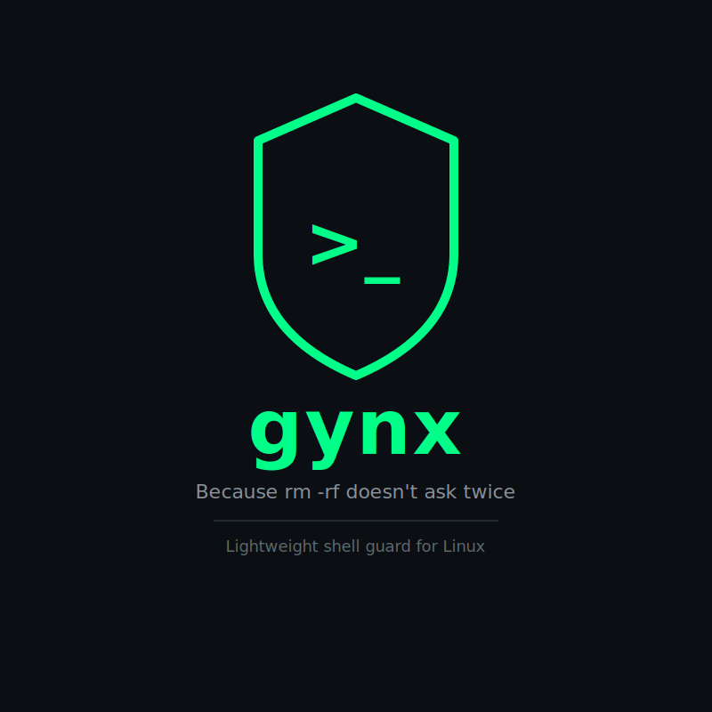

⚠This is work in pogress

# gynx



> *Gynx &mdash; from Tonga (Malawi), meaning "a guard."*

A small  tool that intercepts shell commands and asks you before execution.


## The Problem

The terminal doesn't protect you from yourself.

```bash
rm -rf ./        # wrong directory. everything gone.
mv config.yml /etc/nginx/  # silently overwrites the original
cp -r src/ backup/         # clobbers your backup, no warning
```

No trash bin. No undo. Just gone.


## What Gynx Does

Gynx sits between you and your shell's commands. Before anything runs, it stops and asks:

```
touch /tmp/demo-file
```

```
go run . chmod 777 /tmp/demo-file
```

You'll get:
```
gynx: chmod 777 /tmp/demo-file
warning: Setting world-writable permissions
Proceed? [y/N]: y
```

the output for `y` ofcourse will just be whatever cmd result that binary that went through gives you, but for the `N` option, you'll be presented this:

```
aborted: command not executed
exit status 1
```

It works via shell aliases &mdash; no daemon, no background process, no kernel magic. Just a fast Go binary that intercepts, prompts, then passes through to the real command if you confirm.

Safe commands and non-interactive contexts (scripts, CI pipelines) are passed through silently with zero overhead.


## Watchlist

Gynx ships with somewhat sensible defaults (`rm`, `mv`, `cp` and more to be added soon). Users will be able to add or remove some rules a YAML watchlist:

```yaml
rules:
  - command: chmod
    args_match: ["777", "a+rwx"]
    warning: "Setting world-writable permissions"

  - command: rm
    flags_contain: ["-rf"]
    warning: "Recursive force delete"
```


## Usage

```bash
gynx install          # inject aliases into your shell
gynx add "chmod"      # add a command to your watchlist
gynx remove "chmod"   # remove a command
gynx list             # show active rules
gynx uninstall        # remove all aliases
```

## Future Plans

- **v2 &mdash; eBPF mode:** intercept every command system-wide via kernel-level `execve()` hooking. No aliases needed. Works in any shell or context.
- Community watchlist presets (Docker, Kubernetes, database tooling)
- Dry-run mode &mdash; show what would be intercepted without prompting
- Audit log &mdash; keep a record of intercepted commands
- If it's cp or overwriting a file, show them diffs? or ask them if they meant to rewrite file `x` to `y` 


Please be reminded, this is still in development, you might sometimes not get the desired outcome.
